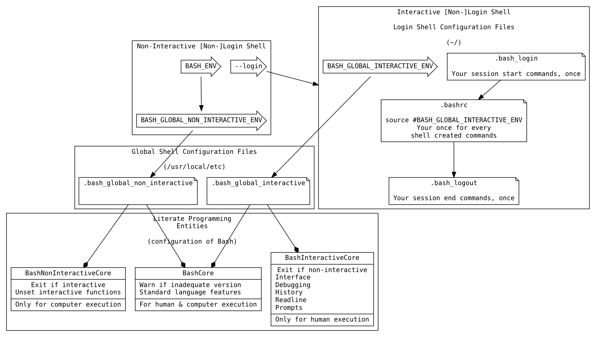

# Research, Goals, & Beginnings

    ID: 7F7F7135-45DD-4AC7-AECA-A69DE6F8F9E2

## Desire

    ID: D309B944-A435-4A26-A23B-9E3B0AA12B70

-   High-quality box provisioning
-   Advanced `bash` knowledge
    -   Have less than basic knowledge
-   Recognition of `bash` as a first-class programming language

## Satisfaction

    ID: B1ECAA5F-07DA-4FE1-9974-86B5FA66124B

-   Search for learning resources
    -   Googled &ldquo;advanced bash&rdquo;, went through first two pages of results and
        selected &ldquo;interesting&rdquo; resources
        -   [Advanced Bash-Scripting Guide](http://www.tldp.org/LDP/abs/html/) <span class="timestamp-wrapper"><span class="timestamp">&lt;2014-03-14 Fri&gt;</span></span>
            -   Comprehensive nice looking contents
        -   [Bourne-Again SHell manual <2015-01-19 Mon> ](https://www.gnu.org/software/bash/manual/)
            -   The user manual
        -   [List of Bash online-tutorials](http://wiki.bash-hackers.org/scripting/tutoriallist)
            -   Ranked index of online resources
        -   [Amazon Kindle Results for "Bash Scripting"](http://www.amazon.com/s/ref=sr_nr_p_n_feature_browse-b_1?fst=as%253Aoff&rh=n%253A283155%252Ck%253ABash+Scripting%252Cp_n_feature_browse-bin%253A618073011&keywords=Bash+Scripting&ie=UTF8&qid=1452906677&rnid=618072011), 29 results, only chose ones
            that were novel or 2015+
        -   Days later revised my search results to: Kindle, 4=stars+ on them and
            this one won with 5/5 stars of 20 reviews. I was looking for 2015
            or newest possible because I wanted Bash 4.2 covered; it added arrays.
            All years of books are probably valuable; I&rsquo;m trying to save time by
            getting everything in one. Might be possible, might not; and I will try.
            The search results seem to include more than the criteria should have
            excluded.
            -   19 search results
            -   Looked for: high ratings, 4 ratings, interesting title and cover
            -   Interesting and pursuing
            -   Interesting stuff, pursuing
                -   A. [Mastering Unix Shell Scripting: Bash, Bourne, and Korn Shell Scripting for Programmers, System Administrators, and UNIX Gurus](http://smile.amazon.com/Mastering-Unix-Shell-Scripting-Administrators-ebook/dp/B004S82Q2K/ref=sr_1_12?s=books&ie=UTF8&qid=1453549654&sr=1-12&keywords=bash+scripting&refinements=p_72%253A1250221011%252Cp_n_feature_nine_browse-bin%253A3291437011%252Cp_n_feature_browse-bin%253A618073011)
                    -   Totally wowed by the reviews
                    -   Pragmatic case studies, no theory, all practice; wow
                -   B. [Linux Command Line and Shell Scripting Bible](http://smile.amazon.com/Linux-Command-Shell-Scripting-Bible-ebook/dp/B00RZDNL5Q/ref=sr_1_4?s=books&ie=UTF8&qid=1453549654&sr=1-4&keywords=bash+scripting&refinements=p_72%253A1250221011%252Cp_n_feature_nine_browse-bin%253A3291437011%252Cp_n_feature_browse-bin%253A618073011)
                    -   Gut feeling is great
                    -   The perennial reference
                    -   Well loved
                -   C. [The Linux Command Line: A Complete Introduction](http://smile.amazon.com/Linux-Command-Line-Complete-Introduction-ebook/dp/B006X2QEQS/ref=sr_1_5?s=books&ie=UTF8&qid=1453549654&sr=1-5&keywords=bash+scripting&refinements=p_72%253A1250221011%252Cp_n_feature_nine_browse-bin%253A3291437011%252Cp_n_feature_browse-bin%253A618073011)
                    -   230/4.5. Looks great.
                    -   Good for beginners; I&rsquo;m kind of a beginner wouldn&rsquo;t hurt to cover
                        the stuff
                -   D. [Unix Power Tools](http://www.amazon.com/Unix-Power-Tools-Shelley-Powers-ebook/dp/B0043EWUT8/ref=sr_1_fkmr1_1?s=books&ie=UTF8&qid=1453570490&sr=8-1-fkmr1&keywords=unix+scripting+pro+100)
                    -   Addictive, almanac, desert island, holy grail
                    -   Primarily for advanced users
                -   E. [Unix and Linux System Administration Handbook](http://www.amazon.com/Unix-Linux-System-Administration-Handbook-ebook/dp/B003YMNVCA/ref=pd_sim_351_2?ie=UTF8&dpID=61Wji3cvETL&dpSrc=sims&preST=_AC_UL160_SR123%252C160_&refRID=1MCP0FZHMWM62X5A02T7)
                    -   Classic, wow
            -   That got me thinking about asking the question
                -   Do I want to learn Bash well? Do I want to learn scripting and system
                    administration well? First, I want to learn Bash well, so I will focus
                    on a Bash scripting book. This is for system admnistration in the form
                    of DevOps, so I will pursue it in that order.
                -   Is this realistic or possible? Starting to narrow it down. Thus far
                    I&rsquo;ve only read review and the title/cover. Reading the blurbs now.
                    -   **+A:** real world, perfect.
                    -   **+D:** mentions zsh, security, and more, didn&rsquo;t want a reference now,
                        and this seems to have everything
                    -   **+E:** Doesn&rsquo;t bloviate, all aspects, wow
                    -   **-B:** seems like a great reference/introduction (refintroduction?)
                        and not something I want given I want Bash stuff this also seems
                        too introductory
                    -   **-C:** mention Vi and deleting files, too basic
                -   Down to 3: A, D, E
                    -   Only want one. Need to scope this somehow.
                    -   Never conidered how much I suck at sysadmin&rsquo;ing, yikes I mean I can
                        make it happen, not too badly, but I never read a single document
                        on &ldquo;being a sysadmin. Maybe it doesn&rsquo;t matter?
                    -   E is out, for the future, scope just too big
                -   Down to 2: A, E
                    -   Review again
                        -   **D:** Sysadmin stuff. Same as devops.
                        -   **A:** says all the right things, develop a GUI with bash, but doesn&rsquo;t
                            get to Shell scripting until part 2 in chapter **11**, signal
                            handling is nice never touched that, advanced scipting doesn&rsquo;t
                            seem that advanced. Book has tone of sysadmin stuff, or if you
                            never used UNIX before. 3 chapters of example scripts that is
                            cool. First half of the book might skip.
                    -   Thoughts
                        -   Both are great books for different reasons
                        -   Perhaps I should get both?
                        -   Reviewed the TOCs again remembering the goal
                            -   A - Ch 1: overview. Everything else examples. Expect, can I use
                                expect to answer prompts for stuff? I should learn Expect. Might
                                not even need something like Monit if it is this simple. Sweet,
                                sweet stuff.
                            -   B - Lookg introductory, but not, all useful stuff, might upt
                                documentation together in mind
                            -   C - basics
                            -   D - shouldl ike it, but don&rsquo;t
                                E - awesome, too much
                        -   Thoughts
                            -   Screwed up lettering, that was a bad idea
                            -   Both A and B look good, B leans more towards an overview thing,
                                which is what I wanted in addition to the reference manual.
                                I&rsquo;ll start there, bought it.

## Decision

    ID: B1375392-9E85-4844-B891-E1E4532E6EEA

-   Read the user manual
    -   It exists for a reason
-   Read one other resource
    -   Provides another perspective, and voice
    -   Balance speed with detail

# Notes

    ID: 036298FF-E47B-463B-8BD0-4E17E84BE525

## DONE Bash Wikipedia

    ID: 5A1D538D-D8FA-4ACE-8019-231C37D5BA62

-   [Here](https://en.wikipedia.org/wiki/Bash_(Unix_shell))
-   Bash is a Unix shell **and** a command language
    -   Programming language and more?
-   It&rsquo;s name
    -   An acronym, pun, and description
        -   Bourne-again
        -   Born-again
        -   Bashed together features of `sh`, `csh`, and `ksh`
-   Great feature overview
-   Lists startup file load sequence
-   Job control explained

## DONE Bash Home Page

    ID: 60856D79-FCB0-4E9C-BBF4-5110161F3C09

-   [Here](https://www.gnu.org/software/bash/)
-   Light overview
-   Joined the mailing list

## DONE Bash Reference Manual

    ID: 068EFDB6-4A97-4502-AE60-2DD3A8F687EC

### Index

    ID: 004E3AAD-6755-4A8C-8B0D-D304E139368B

-   Started [here](https://www.gnu.org/software/bash/manual/html_node/index.html)
-   TOC looks great: basics, quoting and commands, parms, expansion, redirection,
    bultins, variables, features of the language, job control
-   Written version 4.3
-   Each section notes other shells that inspired `bash` features and those unique
    to `bash`

### 1 Introduction

    ID: C770AAA4-9CFE-4963-9580-A7833D98B18D

1.  1.1 What is Bash?

        ID: 319AC703-D580-408D-B601-DF6096C86F2C

    -   &ldquo;Command language interpreter&rdquo; is not synomymous with &ldquo;shell&rdquo;, but it is
        critical to it&rsquo;s function
    -   `bash` is the first programming language that I &ldquo;learned&rdquo;
    -   `bash` is the default shell for GNU

2.  1.2 What is a shell?

        ID: 32D5F6A7-54AB-49BA-8EE9-8646FEA4E0F3

    -   A shell is a macro processor that executes commands
    -   A macro processor expands text and symbols to create new expressions
    -   Is both a command interpreter and programming language
    -   Key point is that newly-creates scripts that use existing commands become
        first-class commands as far as the OS is concerned. Make me think of Scheme
        where language **didn't** let you do so!
    -   Interactive, or not
    -   Synchronous, or asynchrnous command execution
    -   Easily control environment in which commands execute
        -   Already feeling excited about learning `bash`
    -   Programming features: Variables, flow control, quoting, and functions; great
    -   Interactive features: job control, command line editing, command history,
        and aliases

### 2 Definitions

    ID: 8F95FFED-E20E-40F6-BBFB-223432F853C3

-   `POSIX`, does it have a place any more?
-   `control operator` is an important concept (definition)
-   `exit status` is 8 bits (255 values)
-   `field` is a unit of text that is the result of a shell expansion
-   `job` is a pipline any of it&rsquo;s child processes
-   `job control` is a way to start, suspend, resume or stop processes
-   `name` is synonymous with `identifier`
-   `signal` is a notification from the kernel of a system level event

### 3 Basic Shell Features

    ID: 8AF90632-57CB-473C-B8B5-9F874CAB3147

-   Evaluation and quoting are taken from the standard

1.  3.1 Shell Syntax

        ID: A016192D-76B2-4B9B-88FC-F8614047564E

    -   No comment

2.  3.1.1 Shell Operation

        ID: 3B1DE1E8-C252-4A4C-8C38-1FCCAD757F88

    -   `-c` runs code as an argument
    -   Explains program flow in 7 steps

3.  3.1.2 Quoting

        ID: 683EC56D-694E-41FC-8236-CEBAE6573370

    -   It&rsquo;s appearance so early in the documentation reveals it&rsquo;s importance!

4.  3.1.2.1 Escape Character

        ID: 8E13D789-047D-46A4-9F6D-D17B825F49E4

    -   `\` is the Bash escape character
        -   escapes the next single character
            -   Exception being `\newline`

5.  3.1.2.2 Single Quotes

        ID: 098BBAB6-68F9-447A-840F-79006F77DE91

    -   Preserve the literal value of each character
    -   A single quote can&rsquo;t appear here; even when escaped!

6.  3.1.2.3 Double Quotes

        ID: FEE888CD-AFD9-4612-BABF-1E361CDFC434

    -   Preserve the literal value of everything but special characters
        -   So, expansion can be disabled
    -   `$`, `` ` ``, `\` are the special expansion characters
        -   `!` when history expansion is enabled

7.  3.1.2.4 ANSI-C Quoting

        ID: DD23D5B8-E671-43C1-BD33-01FCC5303783

    -   Good to know
    -   Is Unicode supported by Bash?

8.  3.1.2.5 Locale-Specific Translation

        ID: 71103096-FF29-40E7-88B0-06146763AA24

    -   `$` expansions are locale-specific
        -   They aren&rsquo;t covered yet this far in the manual

9.  3.1.3 Comments

        ID: BEF1FC63-328C-4824-BF93-9DF7C9BB6170

    -   `Shopt` builtin lets you disable comments entirely
    -   `#` comments out a line

10. 3.2 Shell Commands

        ID: 8A2313AF-A79B-4557-95AE-609504A805DE

    -   Covers how the command shells processes commands
        -   Should have read this in 1995

11. 3.2.1 Simple Commands

        ID: 7812D66C-8EA5-4D77-AC4F-C0D09949580A

    -   A command is a program and it&rsquo;s arguments

12. 3.2.2 Pipelines

        ID: 572EC419-1357-44DB-B6C4-F8ABAF799923

    -   `Pipelining` means taking the result of one command and passing it to another as
        input via a pipe
    -   Can redirect the standard error output as additional input to the next
        command
        -   Shorthand is `2>&1` which enables it for any following commands
    -   Explains why `time` is a builtin; difficult to do with an external
    -   Each command is executed in a subshell
    -   Enable short-circuit pipline evaluation with `pipefail`

13. 3.2.3 Lists of Commands

        ID: AA9E82E2-2095-4672-8BB2-3377B86556A7

    -   `&` makes commands run asynchronously
    -   `;` makes commands run synchronously
    -   `&&` and `||` are `AND` and `OR` for commands

14. 3.2.4 Compound Commands

        ID: 1E11088A-1E48-4736-94B2-D3AAE6D6CF86

    -   Mentions that you don&rsquo;t have to end grouped commands with `;`, but it might be
        helpful

15. 3.2.4.1 Looping Constructs

        ID: E4AC652C-F353-45E7-9C74-91028470E272

    -   until
        -   until test; do stuff; done
    -   while
        -   while test; do stuff; done
    -   for name [ [ in [words &#x2026;] ] ; do stuff; done
        -   Expand words, and execute stuff for each member of the resulting list, with
            value bound to name
        -   Can also do
            -   for (( expr1 ; expr2 ; expr1 ) ; do commands : done
            -   Way to do stuff to the results of different things, interesting

16. 3.2.4.2 Conditional Constructs

        ID: 5789B914-E9C5-49C2-998B-86956C3E47CF

    -   if
        -   looks like
            -   if test ; then
                -   do stuff
            -   elif test ; then
                -   do more stuff
            -   else more stuff;
            -   fi
    -   case
        -   looks like
            -   case word in [ [(] pattern [&ldquo; pattern]&#x2026;) command-list ;;]&#x2026; esac
        -   Can ignore case with a flag
        -   A clause is a list of patterns and commands for them
        -   Clause words undergo expansion before execution
        -   Idiom is to use `*` as the final pattern so something runs
        -   Nice example to get into the mindset

            ```shell
            echo -n "Enter the name of an animal: "
            read ANIMAL
            echo -n "The $ANIMAL has "
            case $ANIMAL in
                horse | dog | cat) echo -n "four";;
                man | kangaroo ) echo -n "two";;
                *) echo -n "an unknown number of";;
            esac
            echo " legs."
            ```
        -   `;;` short-circuits
        -   `;&` continues execution after a clause match
        -   `;;&` test the next clause
    -   select
        -   Generate menus and commands to do stuff with them, wow
        -   Example to choose files from a directory

            ```shell
            select fname in *;
            do
                echo you picked $fname \($REPLY\)
                break;
            done
            ```
    -   ((&#x2026;))
        -   Evaluate an expression
        -   Braces
    -   Two left brackets &#x2026; two right brackets
        -   Bash conditional expression construct
        -   Word splittin and filename expansion not performed
        -   Every other expansion is performed
        -   In string equality checks, the contents in double quotes are expanded
        -   Can also match strings on regexen using =~
        -   This section will be re-read many times it contains critical aspects of how
            pattern matching works here
        -   Tip: declare regex patterns as a variable to easily use them in a check

17. 3.2.4.3 Grouping Commands

        ID: 1F960005-D906-432E-AA27-C82221EBAFD0

    -   Group commands for execution as a unit
    -   Redirections are performed for the unit
    -   ()
        -   Execute commands in a subshell
    -   {}
        -   Execute commands in the current shell
        -   Ends with a semi-colon

18. 3.2.5 Coprocesses

        ID: 5261575C-D67E-4072-BB03-09F9F32993F8

    -   **WOW** had no clue
    -   Details for usage listed

19. 3.2.6 GNU Parallel

        ID: 89F81750-EE3C-4442-A2F0-2B8FA1C4A41A

    -   Great to know
    -   Helpful examples
    -   Provisioner should be multi-tasking
        -   Install non-conflicting installations simultaneously
        -   Start MacTeX installation at the beginning join it later

20. 3.3 Shell Functions

        ID: 2BE4DE12-5908-45F5-AE10-95053B5B2B78

    -   They are functions
    -   Executed within the current shell
    -   Don&rsquo;t have to declare with &rsquo;function&rsquo;
    -   Lot of optional syntax
        -   () optional if you use function
        -   {} optional in the declaration
    -   Posix mode forbids renaming builtin functions; reason enough to always run in
        posix mode
    -   Your command list either has to end with a newline before the bracket or if
        the bracket is on the same line then end with a semicolon
    -   `#` is the number of parms
    -   `FUNCNAME` is the function executing
    -   Otherwise everything else is the same being in the same shell
    -   `local` declares function local variables
        -   Kind of a big deal to know
    -   Great debugging support, function name and file location
    -   Recursive functions allowed

21. 3.4 Shell Parameters

        ID: 8F10CEAB-C476-4B82-AC0C-A5F522547564

    -   Supports pass-by-reference (nameref), great to know

22. 3.4.1 Positional Parameters

        ID: 71A54B72-8203-461B-8E6D-6602468A66E4

    -   Referenced by `${N}`
    -   `set` and `shift` them in the array

23. 3.4.2 Special Parameters

        ID: 5C9C140D-006F-4E87-B68F-F7F8D30557AE

    -   Read-only
    -   **`*`:** All parms as one value, can expand, or not
    -   **`@`:** All parms as multiple values
    -   **`#`:** Number of parms in decimal
    -   **`?`:** Exit status of late executed statement
    -   **`-`:** Current option flags
    -   **`$`:** Process ID of current shell
    -   **`!`:** Process ID of most recent job placed in background
    -   **`0`:** Name of the shell or shell script
    -   **`_`:** Sets the absolute pathname of the script
    -   Probably a key section for utilizing job control

24. 3.5 Shell Expansions

        ID: 52CE0107-E6A5-4A95-9D2C-058C8770FCF3

    -   These sections might be key to a lot of &ldquo;simple&rdquo; Bash stuff
    -   Order-of-expansion provided
    -   Some systems also have *process substitution*
    -   Expansion is first-class macro expansion, some generating more words, some
        generating one word

25. 3.5.1 Brace Expansion

        ID: 46F26A26-779A-4BCA-BF4B-145D2BC1E0E4

    -   **Purpose:** generate arbitrary strings
    -   **A brace is a squiggly-paren**
    -   Haven&rsquo;t read a document like this since the Scheme days
        -   Precise, details, dense
        -   Full range of expressivity, included with GNU and everything else, why don&rsquo;t
            we learn this instead of using Python? Perhaps because of a higher barrier
            to entry?
    -   Can perform on sequences; results replacing orginal expression
    -   Is **strictly textual**
    -   Specify things to expand either as ranges, or individaul values separated by
        commas
    -   Examples
        -   Make multiple subdirectories
        -   Change ownership of multiple files, matched by regex
            -   Need to internalize this idea, of what to do, to what&#x2026; the &ldquo;to what&rdquo;
                part&#x2026; expansion

26. 3.5.2 Tilde Expansion

        ID: D2705ABB-4D66-4EB4-969C-4F96CE3F0155

    -   **`~`:** the value of `HOME`, and other stuff
    -   **`~+`:** value of `PWD`
    -   **`~-`:** Value of `OLDPWD`
    -   Can access the directory stack by increment or decrement
    -   Used this since forever had no clue what this once, sheesh

27. 3.5.3 Shell Parameter Expansion

        ID: CEE95439-FB52-4E1F-8833-C393C796B4D9

    -   Introuces parm expansion, command subst, or arith expansion
    -   Optionally enclosed by braches (squiggly paren)
    -   Form: ${parm}
        -   Parm is
            -   Substituted
            -   Can be a shell parm
            -   Can be an array references
    -   `!` as first arg used for *indirect expansion* which lets you expand to create
        variable references that are then de-referenced to get the value
        -   Lispy
    -   Lots of conditional logic operators to help manage the usage and setting of
        parameters in conditions of null-ness, or not, and how to handle it
        -   Ruby has that idiom: val = this || do something guaranteed not null and
            it is that kind of stuff here
    -   Trying to internalize this stuff with the examples, same ideas everywhere
        -   Get a substring from a variable, in any direction, via any regex
    -   Can use a regex to get variables named with a name like
    -   Can get the length of values
    -   Powerful constructs abound; nearly overwhelmed
        -   Kind skimmed the last examples, wonder if I should have dug deep
        -   Would be nice to have a guide of only scenarios, or more examples, of when
            you sould use stuff like this
        -   Will revisit again, this seems important

28. 3.5.4 Command Substitution

        ID: E07A9AAC-9D8F-475A-9416-FF94A7746871

    -   Where the output of a command replaces itself
    -   $(cmd)
    -   \`cmd\`
    -   Used a million times, now know why
    -   Can appear in double quotes, without word splitting and filename expansion
    -   Not aliasing

29. 3.5.5 Arithmetic Expansion

        ID: 636157D8-9322-4D6F-B0C5-E96790117F17

    -   Does math: $(( expr ))
    -   Expansions apply to expr like everywhere else

30. 3.5.6 Process Substitution

        ID: 8D09E360-51BA-4400-974E-FD70F01A6F2A

    -   Seems like you capture the outout of a process into a variable or a list to be
        used elsehwere

31. 3.5.7 Word Splitting

        ID: 5E5DB551-9359-41C3-83EE-258AFB2A1537

    -   How words are split by the expander
    -   Totally configurable
    -   Defaults are obvious: space, tab, and newline

32. 3.5.8 Filename Expansion

        ID: 7FF4407B-1432-43E0-A065-445781D44E85

    -   Anytime Bash sees `*`, `?`, and `[` it does matching on the filename
    -   Been using this forever, never knew

33. 3.5.8.1 Pattern Matching

        ID: 4960E2E8-13CB-4AC6-9EB8-FAC3F299E025

    -   Every character matches itself but for the following
    -   **`*`:** Match anything including NULL
        &#x2013; \*\* means something if `globstar` is set, match all files and zero or more
           directories and subdirectories
    -   **`?`:** single char
    -   **`[...]`:** Any one of he enclosed chars.
        -   Can match range expressions
        -   Posix class values also work eg `alpha` or `digit`
    -   You can match on list of patterns, with the typical matching: zoer or one,
        zero or more, one or more, one, and any of them

34. 3.5.9 Quote Removal

        ID: 74CF60B8-C5DF-451D-BE0E-2D8C5BA0F486

    -   Unquoted, expanded `\`, `'` and `"` are removed

35. 3.6 Redirections

        ID: 7D1F0575-5DD1-4FAC-8C4B-2A8AB7A486BA

    -   You can redirect streams to anywhere, and in any command
    -   Valuable info
    -   Small explanation of redirecting stdout and stderr to the same file

36. 3.6.1 Redirecting Input

        ID: 44E790E9-7E80-43F1-B020-7A888B32A4D7

    -   `<` does it

37. 3.6.2 Redirecting Output

        ID: 54C3B01E-A205-48DA-B6AE-454C726F3C74

    -   `>` does it
    -   `noclobber` disabllows overwriting a file
        -   `>|` lets you stomp on it anyway
            -   Maybe always use this if that is the goal

38. 3.6.3 Appending Redirected Output

        ID: F21030A8-3B6E-448A-9975-AD6B9ABEA9F8

    -   `>>` does it

39. 3.6.4 Redirecting Standard Output and Standard Error

        ID: 13A1B3B2-72FB-44CB-B9A2-913B9F5CAFF8

    -   Here is the syntax for what was demo&rsquo;d up above
    -   Redirects it to the same file
    -   `>&word`

40. 3.6.5 Appending Standard Output and Standard Error

        ID: 746F0972-A0C7-46D3-B662-3E7B8D679D7E

    -   `&>>word` does it
        -   Same as `>>word 2>&1`

41. 3.6.6 Here Documents

        ID: 56194F98-E2FC-456F-B203-1E82775971B4

    -   Finally see the defs after using for years
    -   <<[-]word
        -   body
        -   word
    -   Word is expanded unless quoted
    -   `<<-` strips leadings tabs from input and delim line, allowing you to indent the
        script nicely

42. 3.6.7 Here Strings

        ID: C3612AF8-863F-4532-89F4-FF3D2332C1E5

    -   `<<< word`
    -   Result is a string used for a command

43. 3.6.8 Duplicating File Descriptors

        ID: 1D6AA086-7045-4C16-B3E3-380EAEF8AC28

    -   [n]<&word
        -   What do you do with this?

44. 3.6.9 Moving File Descriptors

        ID: 73DF267C-BBEB-4CC1-BBA0-BD8F30449CB9

    -   [n]<&digit-
        -   What do you do with this?

45. 3.6.10 Opening File Descriptors for Reading and Writing

        ID: FC9B5BC8-5C00-444C-97AC-759154F5FAE1

    -   [n]<>word
        -   What do you do with this?

46. 3.7 Executing Commands

        ID: 8134E7E9-1AB2-42F8-A570-0C94BB6B084A

    -   No comment

47. 3.7.1 Simple Command Expansion

        ID: C7C6C532-10BE-4435-BC5F-27D754FA1D2B

    -   Expansion flow is explained
        -   Variables and redirections are processed later
        -   Everything else is expanded
        -   Redirections are performed
        -   Text after `=` in assigments is expanded
    -   If no command name results, assignments affect current environment
        -   Otherwise variables are added to environment of the executed command and
            don&rsquo;t affect the current environment
        -   What?!
    -   The flow described here seems important
        -   Think it is saying that lines with only a set affect current environment,
            and that you can set a var on lines with a command so that the var is set
            in the environment where the command is run
            -   Is this the dynamic extent of the call or does it have to do with
                subshells?
    -   Wonder if I should read the next section on search and execution before
        posing questions here?

48. 3.7.2 Command Search and Execution

        ID: 2051F393-57FB-46AC-B7CE-AAA7CDE98214

    -   Commands without slashes are searched for and if there is a shell function it
        is run
    -   If it doesn&rsquo;t match a function then it is searched for in the builtins
    -   If those both fail it searches the `PATH` for an executable file with that name
        -   There is a variable, a cache of executable files used previously, and this
            `PATH` search only happens if the command isn&rsquo;t found in the cache
        -   There is a handler function if nothing is found
    -   &ldquo;If the search is successful, or if the command name contains one or more
        slashes, the shell executes the named program in a separate execution
        environment.&rdquo;
        -   What does it mean to run in a separate execution environment? Is that a new
            shell or not? Is that just the dynamic extent?
    -   Otherwise it is a shell script that it can run
    -   Whatever *it* is, is run

49. 3.7.3 Command Execution Environment

        ID: 702C1B14-4D7F-400A-B7F9-377F0EB5DC59

    -   The execution environment is
        -   Open files
        -   Current working directory
        -   File creation mode
        -   Traps
        -   Shell parms set by assignment or inherited
        -   Shell functions too
        -   Invoatin options
        -   `shopt` options
        -   aliases too
        -   process IDs, $$, and $PPID
    -   The execution environment of a simple command other than bultins or shell
        functions (like what?) inherits
        -   Just about all the same stuff
    -   Commands invoked in that separate environment cannot affect the shell&rsquo;s
        environment
    -   Commands subsititution occurs in a subshell environment
        -   By design, can&rsquo;t affect the calling shell&rsquo;s environment, good
    -   `&`&rsquo;ing a command when JC is off makes its output go to /dev/null
        -   Random tidbit or best place to note this?

50. 3.7.4 Environment

        ID: 8FB6D4F2-AB6A-4E66-AC35-67BA11FD66E6

    -   Represented by name-value pairs
    -   Managed with `export` and `declare -x`
    -   Can also `unset`

51. 3.7.5 Exit Status

        ID: A93E2F33-3C7A-4E40-9649-0BDDF34C63E8

    -   Rationale for error codes
    -   Some examples
        -   **2:** incorrect usage

52. 3.7.6 Signals

        ID: ADE7A273-D93B-47A9-8D37-8102722580F4

    -   Details overview of what signals Bash ignores and when
    -   Should configure my Bash system with `shopt`
    -   Should study well known signals listed here
        -   `man signal` has a nice list on the 2nd page already
    -   Important coverage of how async calls are handled when signals are generated
        -   Because I don&rsquo;t understand it

53. 3.8 Shell Scripts

        ID: A28DFB40-F0A6-4745-AD92-C3F574890AE9

    -   Calling a shell script invokes a non-interactive shell
    -   Calling a shell script occurs in a subshell
        -   bash filename args
        -   filename args
            -   For executable bit files

### 4 Shell Builtin Commands

    ID: 30C8E257-D36C-4E32-A8BB-04266C8B34B5

-   No comment

1.  4.1 Bourne Shell Builtins

        ID: 2A27B2CA-2409-4B2B-9BA3-778F14C4F96D

    -   The following commands came from the Boune Shell
    -   **`:`:** Do nothing but expand arguments and do redirects
        -   Why?
    -   **`.`:** Read and execute commands from the file within the **current** shell context
        -   Should have been using this during provisioning tasks!
    -   **`break`:** Break from iteration, perhaps at `nth` iteration
    -   **`cd`:** Change directory
    -   **`continue`:** Continue in iteration, perhaps at `nth` iteration
    -   **`eval`:** plan old eval
    -   **`exec`:** Replace teh shell without creating a new process
    -   **`exit`:** Exit
    -   **`export`:** Mark names to be passed to child processes
        -   Probably been using this wrong always
    -   **`getopts`:** Parses optional parms
    -   **`hash`:** Manges the command hash
    -   **`pwd`:** Current working directory
    -   **`readonly`:** Make names (variables) read only
        -   Great to know
        -   Flags for working also on shell functions, indexed array vars, associative
            array vars.
        -   Cause output to be formatted as parsable input
    -   **`return`:** Return
    -   **`shift`:** Shifts positional parms by one
    -   **`test`:** Evaluate a conditional expression
    -   **`times`:** Prints user and sys times
    -   **`trap`:** Define trap handlers
    -   **`umask`:** Set shell process file creation mode
    -   **`unset`:** Remove the thing (a variable or function)
        -   Typo: remvoved

2.  4.2 Bash Builtin Commands

        ID: 3CDA99BD-094D-4D47-A5A1-F0651CC0A748

    -   **`alias`:** Define string substitutions for first word of a command
    -   **`bind`:** Readline stuff
    -   **`builtin`:** Call a builtin with args, helps avoid shadowing
    -   **`caller`:** Get info on dynamic extent context of any subrouting call
    -   **`command`:** Call only shell builtin&rsquo;s or commands in `PATH` with that name,
        and never shell functions
    -   **`declare`:** Declare variables and their attributes
        -   `declare -p`, woaaa, learned this stuff far too late!
        -   Can &ldquo;query&rdquo; variable definitions by type: function, array, &#x2026;
        -   Enable tracing for that name, like functions
        -   Automaticlaly change case of strings on assignment
        -   In functions, `declare` makes things local, like with `local`
        -   Great to know, big deal
    -   **`echo`:** Parms you wish you had known and would never have though to even check
        if they existed before provisioning anything
        -   `-n`, suppress newline printing
        -   Listing of all the escape sequences: bell, backspace, formfeed, tabs
    -   **`enable`:** Enable and disable bultin commands
        -   Lets you tweak existing behavior by disabling and replacing things
            -   Not monkey patching
        -   Obvious how powerful and valuable this is?
    -   **`help`:** Show help on commands
        -   `-d`, describe each pattern
        -   `-m`, describe each pattern in manpage format
        -   `-s`, describe short synopsis for each pattern
    -   **`let`:** Evalute arithmatic
        -   Does it also bind?
    -   **`local`:** Create local variables
        -   Same options as `declare`
        -   Only usable in functions
        -   Scope is the function and its children. What children?
    -   **`logout`:** Excit the shell and return to its parent
    -   **`mapffile`:** Map over lines of a file
        -   Lots of nice options: throw away first line (often col names), toss
            newlines, callback every `N` lines
    -   **`printf`:** Print formatted
        -   Can output to a var
        -   Uses standard `printf` formatting
            -   See \`man printf&rsquo;
        -   %(datefmt)T
            -   Print the result from using `datefmt` with `strftime(3)`
                -   -1, the current time
                -   -2, time the shell was invoked
        -   Bash is scripting language on top of the core OS APIs?!?!!?
            -   References a lot of functions that you can `man` and the are built in C
                libs&#x2026; interesting
    -   **`read`:** Read a value, or multiple, from somewhere
        -   Should care about this considering you use it for asking questions
        -   Easily prompt
        -   Easily timeout
    -   **`readarray`:** Synonym for `mapfile`
    -   **`source`:** Synonym for `.`
    -   **`type`:** Get type of a name (object)
    -   **`typeset`:** Synonym for `declare`
    -   **`ulimit`:** Resource control for shell processes
        -   Great functionality for everything
    -   **`unlaias`:** Remove the name from aliases

3.  4.3 Modifying Shell Behavior

        ID: C9C79DBE-BBB3-4F96-9DA2-BD5AEC61A793

    -   No comment

4.  4.3.1 The Set Builtin

        ID: 9F2E52B6-DBAC-49A3-99B5-3758F96BFF03

    -   Documentations states that this command is complicated
    -   Display names in a format so you can re-set them
    -   Disable and enable filename globbing
    -   Read commands but don&rsquo;t execute them; validates syntax
    -   Set all of the available options by name
    -   Treat unset variables and parms as errors: nice!
    -   Maybe set `PS4` so it is obvious what is happening when `set -x`

    1.  Options

            ID: 27F1F7E4-E1BB-4E5F-B905-A8A60101678F

        -   `allexport`
            -   Same as -a.
            -   -a
                Mark variables and function which are modified or created for export to the environment of subsequent commands.
        -   `braceexpand`
            -   Same as -B.
            -   -B
                The shell will perform brace expansion (see Brace Expansion). This option is on by default.
        -   `emacs`
            -   Use an emacs-style line editing interface (see Command Line Editing). This also affects the editing interface used for read -e.
        -   `errexit`
            -   Same as -e.
            -   -e
                Exit immediately if a pipeline (see Pipelines), which may consist of a single simple command (see Simple Commands), a list (see Lists), or a compound command (see Compound Commands) returns a non-zero status. The shell does not exit if the command that fails is part of the command list immediately following a while or until keyword, part of the test in an if statement, part of any command executed in a && or || list except the command following the final && or ||, any command in a pipeline but the last, or if the command’s return status is being inverted with !. If a compound command other than a subshell returns a non-zero status because a command failed while -e was being ignored, the shell does not exit. A trap on ERR, if set, is executed before the shell exits.
                This option applies to the shell environment and each subshell environment separately (see Command Execution Environment), and may cause subshells to exit before executing all the commands in the subshell.
                If a compound command or shell function executes in a context where -e is being ignored, none of the commands executed within the compound command or function body will be affected by the -e setting, even if -e is set and a command returns a failure status. If a compound command or shell function sets -e while executing in a context where -e is ignored, that setting will not have any effect until the compound command or the command containing the function call completes.
        -   `errtrace`
            -   Same as -E.
            -   -E
                If set, any trap on ERR is inherited by shell functions, command substitutions, and commands executed in a subshell environment. The ERR trap is normally not inherited in such cases.
        -   `functrace`
            -   Same as -T.
            -   -T
            -   If set, any trap on DEBUG and RETURN are inherited by shell functions, command substitutions, and commands executed in a subshell environment. The DEBUG and RETURN traps are normally not inherited in such cases.
        -   `hashall`
            -   Same as -h.
            -   -h
            -   Locate and remember (hash) commands as they are looked up for execution. This option is enabled by default.
        -   `histexpand`
            -   Same as -H.
            -   -H
            -   Enable ‘!’ style history substitution (see History Interaction). This option is on by default for interactive shells.
        -   `history`
            -   Enable command history, as described in Bash History Facilities. This option is on by default in interactive shells.
        -   `ignoreeof`
            -   An interactive shell will not exit upon reading EOF.
        -   `keyword`
            -   Same as -k.
            -   -k
            -   All arguments in the form of assignment statements are placed in the environment for a command, not just those that precede the command name.
        -   `monitor`
            -   Same as -m.
            -   -m
            -   Job control is enabled (see Job Control). All processes run in a separate process group. When a background job completes, the shell prints a line containing its exit status.
        -   `noclobber`
            -   Same as -C.
            -   -C
            -   Prevent output redirection using ‘>’, ‘>&’, and ‘<>’ from overwriting existing files.
        -   `noexec`
            -   Same as -n.
            -   -n
            -   Read commands but do not execute them; this may be used to check a script for syntax errors. This option is ignored by interactive shells.
        -   `noglob`
            -   Same as -f.
            -   -f
            -   Disable filename expansion (globbing).
        -   `nolog`
            -   Currently ignored.
        -   `notify`
            -   Same as -b.
            -   -b
            -   Cause the status of terminated background jobs to be reported immediately, rather than before printing the next primary prompt.
        -   `nounset`
            -   Same as -u.
            -   -u
            -   Treat unset variables and parameters other than the special parameters ‘@’ or ‘\*’ as an error when performing parameter expansion. An error message will be written to the standard error, and a non-interactive shell will exit.
        -   `onecmd`
            -   Same as -t.
            -   -t
            -   Exit after reading and executing one command.
        -   `physical`
            -   Same as -P.
            -   -P
            -   If set, do not resolve symbolic links when performing commands such as cd which change the current directory. The physical directory is used instead. By default, Bash follows the logical chain of directories when performing commands which change the current directory.
                For example, if /usr/sys is a symbolic link to /usr/local/sys then:

                ```shell
                $ cd /usr/sys; echo $PWD
                /usr/sys
                $ cd ..; pwd
                /usr
                ```

                If set -P is on, then:

                ```shell
                $ cd /usr/sys; echo $PWD
                /usr/local/sys
                $ cd ..; pwd
                /usr/local
                ```
        -   `pipefail`
            -   If set, the return value of a pipeline is the value of the last (rightmost) command to exit with a non-zero status, or zero if all commands in the pipeline exit successfully. This option is disabled by default.
        -   `posix`
            -   Change the behavior of Bash where the default operation differs from the POSIX standard to match the standard (see Bash POSIX Mode). This is intended to make Bash behave as a strict superset of that standard.
        -   `privileged`
            -   Same as -p.
            -   -p
            -   Turn on privileged mode. In this mode, the $BASH<sub>ENV</sub> and $ENV files are not processed, shell functions are not inherited from the environment, and the SHELLOPTS, BASHOPTS, CDPATH and GLOBIGNORE variables, if they appear in the environment, are ignored. If the shell is started with the effective user (group) id not equal to the real user (group) id, and the -p option is not supplied, these actions are taken and the effective user id is set to the real user id. If the -p option is supplied at startup, the effective user id is not reset. Turning this option off causes the effective user and group ids to be set to the real user and group ids.
        -   `verbose`
            -   Same as -v.
            -   -v
            -   Print shell input lines as they are read.
        -   `vi`
            -   Use a vi-style line editing interface. This also affects the editing interface used for read -e.
        -   `xtrace`
            -   Same as -x.
            -   -x
            -   Print a trace of simple commands, for commands, case commands, select commands, and arithmetic for commands and their arguments or associated word lists after they are expanded and before they are executed. The value of the PS4 variable is expanded and the resultant value is printed before the command and its expanded arguments.

5.  4.3.2 The Shopt Builtin

        ID: C48D4C30-AA29-4122-B878-2D2D19D1CB0E

    -   Change more shell behavior
    -   Going to have lots of good stuff set; so powerful
        -   Case in point: `autocd`, sheesh yes!!!
    -   Others: handling directory name spelling, bash version compatibility, `dotglob`,
        `extdbug` (what debuggers?), `gnu_errfmt`, `no_empty_cmd_completion`
    -   Why did it take so long to learn Bash?

    1.  Options

            ID: 98784542-1E2F-421F-AC9C-4DB8E2AC0A45

        -   `autocd`
            -   If set, a command name that is the name of a directory is executed as if it were the argument to the cd command. This option is only used by interactive shells.
        -   `cdable_vars`
            -   If this is set, an argument to the cd builtin command that is not a directory is assumed to be the name of a variable whose value is the directory to change to.
        -   `cdspell`
            -   If set, minor errors in the spelling of a directory component in a cd command will be corrected. The errors checked for are transposed characters, a missing character, and a character too many. If a correction is found, the corrected path is printed, and the command proceeds. This option is only used by interactive shells.
        -   `checkhash`
            -   If this is set, Bash checks that a command found in the hash table exists before trying to execute it. If a hashed command no longer exists, a normal path search is performed.
        -   `checkjobs`
            -   If set, Bash lists the status of any stopped and running jobs before exiting an interactive shell. If any jobs are running, this causes the exit to be deferred until a second exit is attempted without an intervening command (see Job Control). The shell always postpones exiting if any jobs are stopped.
        -   `checkwinsize`
            -   If set, Bash checks the window size after each command and, if necessary, updates the values of LINES and COLUMNS.
        -   `cmdhist`
            -   If set, Bash attempts to save all lines of a multiple-line command in the same history entry. This allows easy re-editing of multi-line commands.
        -   `compat31`
            -   If set, Bash changes its behavior to that of version 3.1 with respect to quoted arguments to the conditional command’s ‘=~’ operator and with respect to locale-specific string comparison when using the [[ conditional command’s ‘<’ and ‘>’ operators. Bash versions prior to bash-4.1 use ASCII collation and strcmp(3); bash-4.1 and later use the current locale’s collation sequence and strcoll(3).
        -   `compat32`
            -   If set, Bash changes its behavior to that of version 3.2 with respect to locale-specific string comparison when using the [[ conditional command’s ‘<’ and ‘>’ operators (see previous item).
        -   `compat40`
            -   If set, Bash changes its behavior to that of version 4.0 with respect to locale-specific string comparison when using the [[ conditional command’s ‘<’ and ‘>’ operators (see description of compat31) and the effect of interrupting a command list. Bash versions 4.0 and later interrupt the list as if the shell received the interrupt; previous versions continue with the next command in the list.
        -   `compat41`
            -   If set, Bash, when in POSIX mode, treats a single quote in a double-quoted parameter expansion as a special character. The single quotes must match (an even number) and the characters between the single quotes are considered quoted. This is the behavior of POSIX mode through version 4.1. The default Bash behavior remains as in previous versions.
        -   `compat42`
            -   If set, Bash does not process the replacement string in the pattern substitution word expansion using quote removal.
        -   `complete_fullquote`
            -   If set, Bash quotes all shell metacharacters in filenames and directory names when performing completion. If not set, Bash removes metacharacters such as the dollar sign from the set of characters that will be quoted in completed filenames when these metacharacters appear in shell variable references in words to be completed. This means that dollar signs in variable names that expand to directories will not be quoted; however, any dollar signs appearing in filenames will not be quoted, either. This is active only when bash is using backslashes to quote completed filenames. This variable is set by default, which is the default Bash behavior in versions through 4.2.
        -   `direxpand`
            -   If set, Bash replaces directory names with the results of word expansion when performing filename completion. This changes the contents of the readline editing buffer. If not set, Bash attempts to preserve what the user typed.
        -   `dirspell`
            -   If set, Bash attempts spelling correction on directory names during word completion if the directory name initially supplied does not exist.
        -   `dotglob`
            -   If set, Bash includes filenames beginning with a ‘.’ in the results of filename expansion.
        -   `execfail`
            -   If this is set, a non-interactive shell will not exit if it cannot execute the file specified as an argument to the exec builtin command. An interactive shell does not exit if exec fails.
        -   `expand_aliases`
            -   If set, aliases are expanded as described below under Aliases, Aliases. This option is enabled by default for interactive shells.
        -   `extdebug`
            -   If set, behavior intended for use by debuggers is enabled:
                -   The -F option to the declare builtin (see Bash Builtins) displays the source file name and line number corresponding to each function name supplied as an argument.
                -   If the command run by the DEBUG trap returns a non-zero value, the next command is skipped and not executed.
                -   If the command run by the DEBUG trap returns a value of 2, and the shell is executing in a subroutine (a shell function or a shell script executed by the . or source builtins), a call to return is simulated.
                -   BASH<sub>ARGC</sub> and BASH<sub>ARGV</sub> are updated as described in their descriptions (see Bash Variables).
                -   Function tracing is enabled: command substitution, shell functions, and subshells invoked with ( command ) inherit the DEBUG and RETURN traps.
                -   Error tracing is enabled: command substitution, shell functions, and subshells invoked with ( command ) inherit the ERR trap.
        -   `extglob`
            -   If set, the extended pattern matching features described above (see Pattern Matching) are enabled.
        -   `extquote`
            -   If set, $&rsquo;string&rsquo; and $&ldquo;string&rdquo; quoting is performed within ${parameter} expansions enclosed in double quotes. This option is enabled by default.
        -   `failglob`
            -   If set, patterns which fail to match filenames during filename expansion result in an expansion error.
        -   `force_fignore`
            -   If set, the suffixes specified by the FIGNORE shell variable cause words to be ignored when performing word completion even if the ignored words are the only possible completions. See Bash Variables, for a description of FIGNORE. This option is enabled by default.
        -   `globasciiranges`
            -   If set, range expressions used in pattern matching bracket expressions (see Pattern Matching) behave as if in the traditional C locale when performing comparisons. That is, the current locale’s collating sequence is not taken into account, so ‘b’ will not collate between ‘A’ and ‘B’, and upper-case and lower-case ASCII characters will collate together.
        -   `globstar`
            -   If set, the pattern ‘\*\*’ used in a filename expansion context will match all files and zero or more directories and subdirectories. If the pattern is followed by a ‘/’, only directories and subdirectories match.
        -   `gnu_errfmt`
            -   If set, shell error messages are written in the standard GNU error message format.
        -   `histappend`
            -   If set, the history list is appended to the file named by the value of the HISTFILE variable when the shell exits, rather than overwriting the file.
        -   `histreedit`
            -   If set, and Readline is being used, a user is given the opportunity to re-edit a failed history substitution.
        -   `histverify`
            -   If set, and Readline is being used, the results of history substitution are not immediately passed to the shell parser. Instead, the resulting line is loaded into the Readline editing buffer, allowing further modification.
        -   `hostcomplete`
            -   If set, and Readline is being used, Bash will attempt to perform hostname completion when a word containing a ‘@’ is being completed (see Commands For Completion). This option is enabled by default.
        -   `huponexit`
            -   If set, Bash will send SIGHUP to all jobs when an interactive login shell exits (see Signals).
        -   `interactive_comments`
            -   Allow a word beginning with ‘#’ to cause that word and all remaining characters on that line to be ignored in an interactive shell. This option is enabled by default.
        -   `lastpipe`
            -   If set, and job control is not active, the shell runs the last command of a pipeline not executed in the background in the current shell environment.
        -   `lithist`
            -   If enabled, and the cmdhist option is enabled, multi-line commands are saved to the history with embedded newlines rather than using semicolon separators where possible.
        -   `login_shell`
            -   The shell sets this option if it is started as a login shell (see Invoking Bash). The value may not be changed.
        -   `mailwarn`
            -   If set, and a file that Bash is checking for mail has been accessed since the last time it was checked, the message &ldquo;The mail in mailfile has been read&rdquo; is displayed.
        -   `no_empty_cmd_completion`
            -   If set, and Readline is being used, Bash will not attempt to search the PATH for possible completions when completion is attempted on an empty line.
        -   `nocaseglob`
            -   If set, Bash matches filenames in a case-insensitive fashion when performing filename expansion.
        -   `nocasematch`
            -   If set, Bash matches patterns in a case-insensitive fashion when performing matching while executing case or [[ conditional commands.
        -   `nullglob`
            -   If set, Bash allows filename patterns which match no files to expand to a null string, rather than themselves.
        -   `progcomp`
            -   If set, the programmable completion facilities (see Programmable Completion) are enabled. This option is enabled by default.
        -   `promptvars`
            -   If set, prompt strings undergo parameter expansion, command substitution, arithmetic expansion, and quote removal after being expanded as described below (see Controlling the Prompt). This option is enabled by default.
        -   `restricted_shell`
            -   The shell sets this option if it is started in restricted mode (see The Restricted Shell). The value may not be changed. This is not reset when the startup files are executed, allowing the startup files to discover whether or not a shell is restricted.
        -   `shift_verbose`
            -   If this is set, the shift builtin prints an error message when the shift count exceeds the number of positional parameters.
        -   `sourcepath`
            -   If set, the source builtin uses the value of PATH to find the directory containing the file supplied as an argument. This option is enabled by default.
        -   `xpg_echo`
            -   If set, the echo builtin expands backslash-escape sequences by default.

6.  4.4 Special Builtins

        ID: 2A73626A-01CF-44C9-8C0D-BE362346C00D

    -   Some builtins work differently in Posix mode

### 5 Shell Variables

    ID: 89E085C3-F33B-4288-97C6-84F724EDFAB1

-   No comment

1.  5.1 Bourne Shell Variables

        ID: D841AA57-2367-4D65-9EF1-A11F94C02922

    -   **CDPATH:** `cd` search path
    -   **HOME:** home dir
    -   **IFS:** characters that separate things
    -   **MAIL:** mailfile
    -   **MAILPATH:** mailfiles
    -   **OPTARG:** last option processed by `getopts`
    -   **OPTIND:** index of last option argument by `getopts`
    -   **PATH:** command search path
    -   **PS1:** primary prompt
    -   **PS2:** secondary prompt

2.  5.2 Bash Variables

        ID: 139DAC5E-6CB0-4398-B694-7A5C1ABF14A5

    -   **BASH:** full path used to start current instance
    -   **BASHOPTS:** enabled shell options
    -   **BASHPID:** process ID of current Bash process
    -   **`BASH_ALIASES`:** array of aliases
    -   **`BASH_ARGC`:** argument stack in each frame
    -   **`BASSH_ARGV`:** argument stack in current frame
    -   **`BASH_CMDS`:** hash of cached command locations
    -   **`BASH_COMMAND`:** running or about to run cmd
    -   **`BASH_COMPAT`:** chosen compatiblity version
    -   **`BASH_ENV`:** if exists when executing a shell script, initialize env using it
        before running that script
    -   **`BASH_EXECUTION_STRING`:** For Bash one-liners, this is the string to eval
    -   **`BASH_LINENO`:** array of locations where a command was invoked
    -   **`BASH_REMATCH`:** destructure-bind of parts of regex
    -   **`BASH_SOURCE`:** locations of where functions are defined
    -   **`BASH_SUBSHELL`:** Subshell ID, each subshells increments it by 1
    -   **`BASH_VERSINFO`:** Version info parts in an array
        -   **`BASH_VERSINFO[0]`:** The major version number (the release).
        -   **`BASH_VERSINFO[1]`:** The minor version number (the version).
        -   **`BASH_VERSINFO[2]`:** The patch level.
        -   **`BASH_VERSINFO[3]`:** The build version.
        -   **`BASH_VERSINFO[4]`:** The release status (e.g., beta1).
        -   **`BASH_VERSINFO[5]`:** The value of MACHTYPE.
        -   **`BASH_VERSION`:** The version number of the current instance of Bash.
    -   **`BASH_XTRACEFD`:** Trace output to this file
    -   **`CHILD_MAX`:** How many exited child procs to remember
    -   **COLUMNS:** Terminal width
    -   **`COMP_CWORD`:** Compltion comp word
    -   **`COMP_LINE`:** Completion current word
    -   **`COMP_POINT`:** Completion current point
    -   **`COMP_TYPE`:** Completion type
    -   **`COMP_KEY`:** Completion key
    -   **`COMP_WORDBREAKS`:** Completion word separators
    -   **`COMP_WORDS`:** array of words in the current commandline
    -   **COMPREPLY:** possible completions
    -   **COPROC:** file descriptors used to talk to unnamed corpoc
    -   **DIRSTACK:** as named, `push and =pop`, to change just assign
    -   **EMACS:** if `t`, is inside Emacs, so disable line editing
    -   **ENV:** like `BASH_ENV`, but for Posix
    -   **EUID:** effective user ID
    -   **FCEDIT:** editor for `fc`
    -   **FIGNORE:** filenames to ignore when completing
    -   **FUNCNAME:** array of function names executing
        -   Use with `BASH_LINENO` and `BASH_SOURCE`
    -   **FUNCNEST:** max func nesting level
    -   **GLOBIGNORE:** files names to ignore during expansion
    -   **GROUPS:** current user is a member of these listed
    -   **histchars:** Configures
        -   **1:** history expansion
        -   **2:** quick substitution
        -   **3:** line comment indicator
    -   **HISTCMD:** Current line in history
    -   **HISTCONTROL:** configure how commands are saved
    -   **HISTFILE:** history file name, default `~/.bash_history`.
    -   **HISTFILESIZE:** max line count
    -   **HISTIGNORE:** pattern for which lines should be saved
    -   **HISTIGNORE:** takes over work for `HISTCONTROL`
    -   **HISTSIZE:** number of commands to remember
    -   **HISTTIMEFORMAT:** set `strftime` format for history entries
    -   **HOSTFILE:** entries to complete hostnames
    -   **HOSTNAME:** it is
    -   **HOSTTYPE:** platform ino
    -   **IGNOREEOF:** how to handle end of file
    -   INPUTRC ::Readline init file; stomps on default ~/.inputrc.
    -   **LANG:** Set locale
    -   **`LC_ALL`:** Overrisde all locale vars
    -   **`LC_COLLATE`:** Collation order when sorting stuff
    -   **`LC_CTYPE`:** Character class expanstion and matching behavior config
    -   **`LC_MESSAGES`:** Config for expanding double-quoted strings
    -   **`LC_NUMERIC`:** Config for number formatting
    -   **LINENO:** Current executing line
    -   **LINES:** visible lines in terminal
    -   **MACHTYPE:** cpu desc in the standard GNU cpu-company-system format.
    -   **MAILCHECK:** how often in second to check for mail
    -   **MAPFILE:** array var to store read values
    -   **OLDPWD:** previous wd
    -   **OPTERR:** if 1, shoe `getopt` errors
    -   **OSTYPE:** os type
    -   **PIPESTATUS:** list of pipeline exit values
    -   **`POSIXLY_CORRECT`:** If exists before startup, start in Posix mode
    -   **PPID:** Parent process id
    -   **`PROMPT_COMMAND`:** Command to execute before rendering `PS1`
    -   **`PROMPT_DIRTRIM`:** How many dirs to include when compelting
    -   **PS3:** select prompt
    -   **PS4:** `set -x` debugging prompt
    -   **PWD:** cwd
    -   **RANDOM:** rng, can seed it
    -   **`READLINE_LINE`:** contents of readline buf
    -   **`READLINE_POINT`:** insertion point in readline buf
    -   **REPLY:** `read` default var
    -   **SECONDS:** seconds since shell was started
    -   **SHELL:** pathname to shell, set after shell starts
    -   **SHELLOPTS:** list of shell options
    -   **SHLVL:** show how deeply nested your shells are
    -   **TIMEFORMAT:** how timing info is formatted
    -   **TMOUT:** read timeout in seconds
    -   **TMPDIR:** place to create tmp files
    -   **UID:** real UID

### 6 Bash Features

    ID: F921F61C-183E-4C87-91A2-210130B18B2B

-   No comment

1.  6.1 Invoking Bash

        ID: FF94CBB8-569C-41E2-B031-CD16730C45CD

    -   Lots of interactive startup config commands
    -   Some you can&rsquo;t do with `getopts`
    -   `--noprofile` good for debugging, `--norc` too

2.  6.2 Bash Startup Files

        ID: 931D2B7D-2568-4217-9B12-2809E1FCCD99

    -   Invoked as an interactive login shell, or with &#x2013;login
        -   Read `/etc/profile` and execute
        -   Read and execute first one that exists and is readable
            -   `~/.bash_profile`
            -   `~/.bash_login`
            -   `~/.profile`
        -   On exit, read and run `~/.bash_logout` if it exists.
    -   Invoked as an interactive non-login shell
        -   Read and execute `~/.bashrc`, if that file exists
            -   &ldquo;So, typically, your ~/.bash<sub>profile</sub> contains the line&rdquo;

                ```shell
                if [ -f ~/.bashrc ]; then . ~/.bashrc; fi after (or before) any login-specific
                initializations.
                ```
        -   Seems like separating interactive and non-interactive features goes in those
            places
    -   Invoked non-interactively
        -   Uses `BASH_ENV` to execute the file

    -   Invoked with name sh
        -   Mimic `sh` startup behavior
        -   Auto-enter Posix mode
        -   Never use this
    -   Invoked in POSIX mode
        -   Follow Posix standard for startup files
    -   Invoked by remote shell daemon
        -   Use ~/.bashrc
    -   Invoked with unequal effective and real UID/GIDs
        -   Don&rsquo;t read anything

3.  6.3 Interactive Shells

        ID: B0F7B1AF-5E43-4D11-9950-55CFDC3817DA

    -   No comment

4.  6.3.1 What is an Interactive Shell?

        ID: 81E4FAFF-64DA-4455-B038-2F6BED8AFB32

    -   One started with stdin and stdout and stderr attached to terminals
        -   There is more to this, not worth mentioning right now

5.  6.3.2 Is this Shell Interactive?

        ID: 38920E91-6BD3-4D4A-A53E-710289870FDD

    -   Show how to check, 2 ways

6.  6.3.3 Interactive Shell Behavior

        ID: BB0E956F-46D2-4227-B5AF-CA56D7994405

    -   Startup files loaded
    -   Job control is on
    -   PS1 and PS2 used
    -   prompt command run
    -   Readline turned on
    -   EOF handling on
    -   Command history on
    -   Alias expansion on
        -   Good to know that this is just interactive!
    -   sigterm ignored without traps
    -   sigint ignored without traps
    -   sighup sent if configured
    -   Ignore -n
    -   Check for mail periodically
    -   Expansion errors won&rsquo;t cause the shell to exit
        -   Biggie!
    -   Neither will redirection errors
    -   Neither will Posix errors
    -   Neither will a failed exec
    -   cdspell is great
    -   read and TMOUT

7.  6.4 Bash Conditional Expressions

        ID: 0A460C36-83AA-4B7D-AB18-F314DB7FBE53

    -   Conditional expressions used by
        -   [[
        -   test
        -   [
    -   Important used **all over the place**
    -   Note: [[, <, and > sort lexographically; test uses ASCII!
    -   So rich and expressive, says so much
    -   Subexpressions are evaluated first
    -   They follow in order, copy pasted
    -   -a file
        -   True if file exists.
    -   -b file
        -   True if file exists and is a block special file.
    -   -c file
        -   True if file exists and is a character special file.
    -   -d file
        -   True if file exists and is a directory.
    -   -e file
        -   True if file exists.
    -   -f file
        -   True if file exists and is a regular file.
    -   -g file
        -   True if file exists and its set-group-id bit is set.
    -   -h file
        -   True if file exists and is a symbolic link.
    -   -k file
        -   True if file exists and its &ldquo;sticky&rdquo; bit is set.
    -   -p file
        -   True if file exists and is a named pipe (FIFO).
    -   -r file
        -   True if file exists and is readable.
    -   -s file
        -   True if file exists and has a size greater than zero.
    -   -t fd
        -   True if file descriptor fd is open and refers to a terminal.
    -   -u file
        -   True if file exists and its set-user-id bit is set.
    -   -w file
        -   True if file exists and is writable.
    -   -x file
        -   True if file exists and is executable.
    -   -G file
        -   True if file exists and is owned by the effective group id.
    -   -L file
        -   True if file exists and is a symbolic link.
    -   -N file
        -   True if file exists and has been modified since it was last read.
    -   -O file
        -   True if file exists and is owned by the effective user id.
    -   -S file
        -   True if file exists and is a socket.
    -   file1 -ef file2
        -   True if file1 and file2 refer to the same device and inode numbers.
    -   file1 -nt file2
        -   True if file1 is newer (according to modification date) than file2, or if file1 exists and file2 does not.
    -   file1 -ot file2
        -   True if file1 is older than file2, or if file2 exists and file1 does not.
    -   -o optname
        -   True if the shell option optname is enabled. The list of options appears in the description of the -o option to the set builtin (see The Set Builtin).
    -   -v varname
        -   True if the shell variable varname is set (has been assigned a value).
    -   -R varname
        -   True if the shell variable varname is set and is a name reference.
    -   -z string
        -   True if the length of string is zero.
    -   -n string
    -   string
    -   - True if the length of string is non-zero.
    -   string1 == string2
    -   - string1 = string2
        -   True if the strings are equal. When used with the [[ command, this performs pattern matching as described above (see Conditional Constructs).
    -   - ‘=’ should be used with the test command for POSIX conformance.
    -   string1 != string2
    -   - True if the strings are not equal.
    -   string1 < string2
    -   - True if string1 sorts before string2 lexicographically.
    -   string1 > string2
    -   - True if string1 sorts after string2 lexicographically.
    -   arg1 OP arg2
        -   OP is one of ‘-eq’, ‘-ne’, ‘-lt’, ‘-le’, ‘-gt’, or ‘-ge’. These arithmetic binary operators return true if arg1 is equal to, not equal to, less than, less than or equal to, greater than, or greater than or equal to arg2, respectively. Arg1 and arg2 may be positive or negative integers.

8.  6.5 Shell Arithmetic

        ID: 77D9A4A9-730F-41CE-9F4F-1117CB47BE96

    -   Operator behavior same as in C
    -   Following identifiers copied and pasted
    -   id++ id&#x2013;
        -   variable post-increment and post-decrement
    -   ++id &#x2013;id
        -   variable pre-increment and pre-decrement
    -   - +
        -   unary minus and plus
    -   ! ~
        -   logical and bitwise negation
    -   \*\*
        -   exponentiation
    -   \* / %
        -   multiplication, division, remainder
    -   + -
        -   addition, subtraction
    -   << >>
        -   left and right bitwise shifts
    -   <= >= < >
        -   comparison
    -   `= !`
        -   equality and inequality
    -   &
        -   bitwise AND
    -   ^
        -   bitwise exclusive OR
    -   |
        -   bitwise OR
    -   &&
        -   logical AND
    -   ||
        -   logical OR
    -   expr ? expr : expr
        -   conditional operator
    -   = \*= /= %= += -= <<= >>= &= ^= |=
        -   assignment
    -   expr1 , expr2
        -   comma

9.  6.6 Aliases

        ID: D418A98E-DD17-453A-A752-6949795831BA

    -   String substitution of aliases when used as first word of simple command
    -   Recursive alias expansion is not allowed; so ls/ls -al works without an
        infinite loop
    -   Only expanded in inteactive mode!
        -   Unless shopt `expand_aliases`
        -   Should do this, more predictable
    -   &ldquo;To be safe
        -   always put alias definitions on a separate line
        -   and do not use alias in compound command&ldquo;
    -   &ldquo;For almost every purpose, shell functions are preferred over aliases.&rdquo;
        -   Obvious good purpose is command defs

10. 6.7 Arrays

        ID: 56022EBD-6457-46E7-B6FB-AC0651744F81

    -   Are
        -   One-dimensional
            -   Zero-based
        -   Associative
            -   Using strings
    -   Declaring is better, can declare by using too
    -   Compound assignment: name=(val1 val2 val3)
        -   val is: 0=foo
    -   Array reference: ${name[subscript]}
        -   When subscript is @ or \*, expand to all members
            -   Behavior diffs in
                -   Double quotes, \*: single word with all values
                -   Double quotes, @: separate words
    -   &ldquo; ${!name[@]} and ${!name[\*]} expand to the indices assigned in array
        variable name. &rdquo;
    -   `unset` destroys arrays and their contents, individually
    -   `read` right into an array

11. 6.8 The Directory Stack

        ID: B39ED8E8-AFC0-4CEA-BECA-6BEC89703ACE

    -   pushd, popd, dirs, DIRSTACK

12. 6.8.1 Directory Stack Builtins

        ID: C8C7B9F7-3E56-47C0-8341-F543372B0276

    -   dirs
        -   Look forward to see how this is utilized
    -   popd
        -   Easy on
        -   alias &ldquo;pod&rdquo;?
    -   pushd
        -   Alias &ldquo;pd&rdquo; and use all the time? Might be nice to have that breadcrumb
            trail all the time.

13. 6.9 Controlling the Prompt

        ID: 605699B1-C40A-4D11-B644-5B147FF56468

    -   The following are copied and pasted
    -   Commands have a number for the current session, and a number for the overall
        history
    -   \a
        -   A bell character.
    -   \d
        -   The date, in &ldquo;Weekday Month Date&rdquo; format (e.g., &ldquo;Tue May 26&rdquo;).
    -   \D{format}
        -   The format is passed to strftime(3) and the result is inserted into the
            prompt string; an empty format results in a locale-specific time
            representation. The braces are required.
    -   \e
        -   An escape character.
    -   \h
        -   The hostname, up to the first ‘.’.
    -   \H
        -   The hostname.
    -   \j
        -   The number of jobs currently managed by the shell.
    -   \l
        -   The basename of the shell’s terminal device name.
    -   \n
        -   A newline.
    -   \r
        -   A carriage return.
    -   \s
        -   The name of the shell, the basename of $0 (the portion following the final
            slash).
    -   \t
        -   The time, in 24-hour HH:MM:SS format.
    -   \T
        -   The time, in 12-hour HH:MM:SS format.
    -   \\@
        -   The time, in 12-hour am/pm format.
    -   \A
        -   The time, in 24-hour HH:MM format.
    -   \u
        -   The username of the current user.
    -   \v
        -   The version of Bash (e.g., 2.00)
    -   \V
        -   The release of Bash, version + patchlevel (e.g., 2.00.0)
    -   \w
        -   The current working directory, with $HOME abbreviated with a tilde (uses the
            $PROMPT<sub>DIRTRIM</sub> variable).
    -   \W
        -   The basename of $PWD, with $HOME abbreviated with a tilde.
    -   \\!
        -   The history number of this command.
    -   \\#
        -   The command number of this command.
    -   \\$
        -   If the effective uid is 0, #, otherwise $.
    -   \nnn
        -   The character whose ASCII code is the octal value nnn.
    -   -   A backslash.
    -   \\[
        -   Begin a sequence of non-printing characters. This could be used to embed a
            terminal control sequence into the prompt.
    -   \\]
        -   End a sequence of non-printing characters.

14. 6.10 The Restricted Shell

        ID: 511240EC-EB9C-4821-B615-3A4811247FA7

    -   Nice!
        -   Should have set ulimits for every deployed Linux server app ever

15. 6.11 Bash POSIX Mode

        ID: 95F1D555-851C-454A-ABC1-9ED5CDEEB199

    -   Explains everything different from normal Bash mode

### 7 Job Control

    ID: 2B4E490F-8BA0-4D27-8E31-180F338FFA6C

-   No comment

1.  7.1 Job Control Basics

        ID: 5ED07909-35A4-495C-851B-279626854356

    -   Get the easy part; look forward to digging into details to allow async
        provisioning

2.  7.2 Job Control Builtins

        ID: CAD99231-CCEC-4EB7-B494-438612CC4767

    -   Awesome. Everything is there. Should have read this 21 years ago. Now is great.
        Usable for provisioning; speed up downloads.

3.  7.3 Job Control Variables

        ID: A0AF0CFF-E683-40DF-8961-E33E2766C79E

    -   OK

### 8 Command Line Editing

    ID: 7496C9A0-8C2F-4C82-978B-E84E822AB2B6

-   Emacs bindings by default

1.  8.1 Introduction to Line Editing

        ID: F99ADED0-7452-4A55-AF59-5DABF691021D

    -   Emacs keybinding terminology

2.  8.2 Readline Interaction

        ID: FB43CD4F-D138-46F3-9450-685237A03F37

    -   `RET` works anywhere on the current line since you can easily move around
    -   Readline is great

3.  8.2.1 Readline Bare Essentials

        ID: D2C78045-8898-4C01-92CB-EFAE0129DF29

    -   Emacs bindings

4.  8.2.2 Readline Movement Commands

        ID: F3F59F89-42EE-41D0-B630-658A7C388DB7

    -   Emacs bindings

5.  8.2.3 Readline Killing Commands

        ID: 1773DBEB-88A5-412A-AB13-B769D7412423

    -   Emacs bindings

6.  8.2.4 Readline Arguments

        ID: E9BB713D-03AC-4B0A-82AA-335F9A07D42F

    -   Not C-u

7.  8.2.5 Searching for Commands in the History

        ID: F860CFE1-2559-4932-9727-10B9286AC6C7

    -   Want to use it and can&rsquo;t make it work

8.  8.3 Readline Init File

        ID: 07D5F7A1-0BFF-444C-8EFD-7F281EEEC4CB

    -   `INPUTRC` configures Readline

9.  8.3.1 Readline Init File Syntax

        ID: 2ED02D68-1F0C-4543-8EFC-EEBB52A376AF

    -   Should read through and configure all these
        -   Interesting: visible bell, colored status, eiditng-mode,
            -   This is all different from plain old Bash shell stuff?

10. 8.3.2 Conditional Init Constructs

        ID: CDE0082F-24B2-4FD3-AE17-7D52DCEC3DE4

    -   OK

11. 8.3.3 Sample Init File

        ID: 69177446-F6E2-4650-A5CC-BB01C711434F

    -   OK

12. 8.4 Bindable Readline Commands

        ID: B3FCF3F4-C4EB-4EEE-BEEA-061A3CC018CD

    -   OK

13. 8.4.1 Commands For Moving

        ID: 1D97E346-02FE-48C0-ACC5-1692E0A19B3B

    -   Emacs bindings

14. 8.4.2 Commands For Manipulating The History

        ID: AD00F828-4F66-4859-91D2-1067814094D8

    -   Emacs bindings

15. 8.4.3 Commands For Changing Text

        ID: F1E984E1-5108-4DF0-A27B-B094F61C8DD9

    -   Emacs bindings

16. 8.4.4 Killing And Yanking

        ID: B840F64B-6717-4288-821F-D76E02876B9C

    -   Emacs bindings

17. 8.4.5 Specifying Numeric Arguments

        ID: AA19B747-C6ED-4F3E-AAF5-C8A787D8B259

    -   Not like Emacs, note this

18. 8.4.6 Letting Readline Type For You

        ID: 872516EC-DFE9-4419-B584-A8081755A14F

    -   Everybody has been using this forever
        -   Probably most important feature nobody ever read about

19. 8.4.7 Keyboard Macros

        ID: 70672FF8-43D0-4432-8DFB-727F4772CB42

    -   Readline lets you record and replay keyboard macros?!!??!
        -   **YES**

20. 8.4.8 Some Miscellaneous Commands

        ID: 7B8BFF47-ADB7-4AC5-8EF0-02E63F61F365

    -   Reload init file, undo, set mark&#x2026; miscellaneous and valuable!

21. 8.5 Readline vi Mode

        ID: A9BB0032-2976-4815-9677-9C5CAEC7FC16

    -   OK

22. 8.6 Programmable Completion

        ID: 2B95C0E4-D443-4D7D-B9AD-D0C3FA42FA64

    -   Know what it is, skimmed it until I need it

23. 8.7 Programmable Completion Builtins

        ID: 815D2DCB-8585-4D5E-B27E-DCCB52AFD887

    -   Cool!

24. 8.8 A Programmable Completion Example

        ID: 64EE7C39-2133-45F8-ADC0-AD312B5C7338

    -   Nice to read some non-trivial code finally
        -   Finally readable after reading the manual!

### 9 Using History Interactively

    ID: 00866989-F35A-4112-AA89-DFE1E7AF261C

-   Nice

1.  9.1 Bash History Facilities

        ID: E07E9595-14EB-4619-890E-B50E9690531C

    -   Set timestamp to ISO8601

2.  9.2 Bash History Builtins

        ID: 40E06598-BAF6-47D1-A773-D3CB03C19ACD

    -   Never knew about `fc`; knew about `history`

3.  9.3 History Expansion

        ID: B71765C5-FD10-4EFB-A9BB-9B58CF245CE1

    -   OK

4.  9.3.1 Event Designators

        ID: B260B2F2-5AF9-4604-846B-B1179C49B492

    -   OK

5.  9.3.2 Word Designators

        ID: 9E19BEE0-421D-4881-A685-96B0A4725BBE

    -   OK

6.  9.3.3 Modifiers

        ID: 17FB78A6-E448-440D-ACBD-F4D3A63D4286

    -   OK

### 10 Installing Bash

    ID: 3DF2BED9-4C92-4F91-A305-49F7B6280A99

-   Skipping this headline until I need to do it
    -   Brew does it

1.  10.1 Basic Installation

        ID: 792C765A-9A86-4F65-B198-D2F9CF88F842

    -   Skipping this headline until I need to do it

2.  10.2 Compilers and Options

        ID: 08A34A00-342D-45D6-85B9-009582146AA8

    -   Skipping this headline until I need to do it

3.  10.3 Compiling For Multiple Architectures

        ID: AD398BF1-6B36-49DC-8774-ECFC0CC8A03F

    -   Skipping this headline until I need to do it

4.  10.4 Installation Names

        ID: F502FF3F-3937-4D03-BBC8-F613B2EF97BC

    -   Skipping this headline until I need to do it

5.  10.5 Specifying the System Type

        ID: 1180CAC6-674F-4335-91D2-C18C39D26435

    -   Skipping this headline until I need to do it

6.  10.6 Sharing Defaults

        ID: 22958C04-DA00-4ECF-BE65-AFC05A3CAFE9

    -   Skipping this headline until I need to do it

7.  10.7 Operation Controls

        ID: 3394F331-897D-47D5-AE4B-3A923E154511

    -   Skipping this headline until I need to do it

8.  10.8 Optional Features

        ID: D812B51C-A080-4A4A-9074-E2254CFEF980

    -   Skipping this headline until I need to do it

### Appendix A Reporting Bugs

    ID: 1BD98809-C864-440F-A119-8DE89DFE2702

-   OK

### Appendix B Major Differences From The Bourne Shell

    ID: 6F691295-508B-415D-80CA-AB04EC9EA8F0

-   OK, skimmed it

1.  B.1 Implementation Differences From The SVR4.2 Shell

        ID: 671631BF-F111-44F9-8FE3-4065EA64652F

    -   OK, skimmed it

### Appendix C GNU Free Documentation License

    ID: DA3E41E5-E909-442A-AAFA-835BE0BE0504

-   OK, skimmed it

### Appendix D Indexes

    ID: B5B3AB49-1060-43A7-BB82-FD99C97D7512

-   Everything in this heading is for use by reference so no notes to follow

1.  D.1 Index of Shell Builtin Commands

        ID: 4BE4B254-1B1E-4326-A090-3F15D226EB0B

    -   Everything in this heading is for use by reference so no notes to follow

2.  D.2 Index of Shell Reserved Words

        ID: 684FF389-DFD2-4EAF-A55E-B0193038D82B

    -   Everything in this heading is for use by reference so no notes to follow

3.  D.3 Parameter and Variable Index

        ID: 2021AF7F-A7C1-4580-B96D-141E2B986EE7

    -   Everything in this heading is for use by reference so no notes to follow

4.  D.4 Function Index

        ID: F0F1570C-EE87-4C19-87CC-2583735F56C2

    -   Everything in this heading is for use by reference so no notes to follow

5.  D.5 Concept Index

        ID: 008EB361-5070-4E9D-A187-483FAB853083

    -   Everything in this heading is for use by reference so no notes to follow

## TODO Bash Debugger

    ID: 4DF379DD-3A65-4802-9725-B184A64787DB

-   [Here](http://bashdb.sourceforge.net/bashdb.html)
-   Just skimmed it for now
-   Picked up this valuable add

```sh
PS4='(${BASH_SOURCE}:${LINENO}): ${FUNCNAME[0]} - [${SHLVL},${BASH_SUBSHELL}, $?]
'
```

## TODO Bash FAQ

    ID: 42D2E376-FD07-41EF-91F7-673072BC412A

-   [Here](ftp://ftp.cwru.edu/pub/bash/FAQ)
-   Seems like a good document to skim

## Questions answered with web search results

    ID: E640A774-E706-4903-88F0-3808FED40580

### Can you prompt the user from a non-interactive script?

    ID: 53564093-9C8B-4C6D-9943-D4250F5F7BD6

-   [How do I prompt for input in a Linux shell script?](https://stackoverflow.com/questions/226703/how-do-i-prompt-for-input-in-a-linux-shell-script)
    -   List of every way to prompt the user

### What is the difference between login-shell-interactive and non-login-shell-interactive and non-login-shell non-interactive?

    ID: 07A853B3-C5A8-4C1B-AA70-6BCD691647ED

-   Is the choice up to the user or the operating system?
-   Can non-login shells interact with the user?
-   Is it entirely a user choice; you act from a `tty`, or you don&rsquo;t?

### How is Bash initialized?

    ID: FFA3E8B1-EDF9-4309-823E-2DD7C5D9423B

-   [Understanding a little more about /etc/profile and /etc/bashrc](http://bencane.com/2013/09/16/understanding-a-little-more-about-etcprofile-and-etcbashrc/)

### Bash vs Dash

    ID: 470A6250-A768-4244-8457-786AA332039E

-   [DashAsBinSh](https://wiki.ubuntu.com/DashAsBinSh)
-   Make Bash the default on Ubuntu
    -   [Configure Ubuntu to use Bash as default shell instead of Dash](http://www.humbug.in/2012/configure-ubuntu-to-use-bash-as-default-shell-instead-of-dash/)
    -   [How to change default shell from dash to bash in ubuntu](http://anandmpandit.blogspot.com/2011/09/how-to-change-default-shell-from-dash.html)
    -   [How to do **dpkg-reconfigure dash** as bash automatically](https://superuser.com/questions/715722/how-to-do-dpkg-reconfigure-dash-as-bash-automatically)
    -   [UBUNTU CHANGING DASH TO BASH](https://justinconover.wordpress.com/2012/05/14/ubuntu-changing-dash-to-bash/)
-   [Bash vs dash](https://www.wikivs.com/wiki/Bash_vs_dash)
    -   Bash is 900K and feature rich non-POSIX
    -   Dash is 100K and feature poor POSIX
-   [/bin/sh – checking for bash vs dash incompatibilities](http://lkhill.com/binsh-checking-for-bash-vs-dash-incompatibilities/)
    -   Check for *bashisms* sneaking into POSIX scripts
-   [Bourne is not bash (or: read, echo, and backslash)](http://shebang.brandonmintern.com/bourne-is-not-bash-or-read-echo-and-backslash/)
-   [How to make bash scripts work in dash](http://mywiki.wooledge.org/Bashism)
    -   Great Bash site

### What are some concise Bash articles?

    ID: 39883C0F-B62D-4C82-889D-EFE6E93E67E0

-   [Bash One-Liners Explained, Part IV: Working with history](http://www.catonmat.net/blog/bash-one-liners-explained-part-four/)
-   [Bash Reference Sheet](http://mywiki.wooledge.org/BashSheet)

### What are some Bash best practices?

    ID: B16CD75F-BBA6-4291-AE59-6141D3829E37

-   [Best Practices for Writing Bash Scripts](http://kvz.io/blog/2013/11/21/bash-best-practices/)
    -   Good test of how well you read the configuration options and revealing
        of how you might break up configuration scripts

### Everything related to configuring Bash on OS X

    ID: 0132E8EF-84B4-40DD-9DB8-1750E5AC0EA8

-   [HowTo: Set an Environment Variable in Mac OS X](http://www.dowdandassociates.com/blog/content/howto-set-an-environment-variable-in-mac-os-x/)

### How to other people&rsquo;s Bash configurations look?

    ID: 2A62E003-3068-4CF7-8AB2-6ED23118102A

-   [LoveIsGrief/bash<sub>env</sub>](https://github.com/LoveIsGrief/bash_env)

### How to configure `BASH_ENV`?

    ID: C8B23409-D006-4C0A-88FD-B6A8825FA043

-   [Where is $BASH<sub>ENV</sub> usually set?](https://serverfault.com/questions/593472/where-is-bash-env-usually-set)

### What is the POSIX shell standard?

    ID: D3746650-253F-445B-B84D-160497D9F7D6

-   <http://pubs.opengroup.org/onlinepubs/9699919799/utilities/V3_chap02.html>

# Making Sense of this Script

    ID: 886036D5-3715-492B-9ABF-825F4058A995

## Desires

    ID: C1CA8CCE-D299-4034-8ACA-432622B38640

-   Things that I want to do with Bash, and how I want to do them
    -   Understand the computer and its operating system
        -   Explore the contents of the disk drive and memory
    -   Automated tedious and error prone tasks as quickly as possible
        -   Develop shell scripts to do so
        -   Leverage multi-tasking
    -   Maximize expressivity and predictability
        -   Maximize predictability
        -   Minimize surprise
        -   Fail fast

## Approach to Learning and Configuring Bash

    ID: 9C4ED82B-B909-4546-9AA4-EC1877223C8D

-   Bash provides a rich and complicated configuration facility
-   Successfully solving problems with Bash requires that you (goal)
    -   Understand what it can do
    -   Configure it to do so in a way that you prefer
-   Working with Bash provides the results by recognizing that you attain practice
    and experience (means)
    -   Understanding possibilities requires study and practice (practice)
    -   Configuring requires experience and personal-preference (experience)
-   The purpose of this document is to capture both the means and the goal

## The Purpose of Bash

    ID: 20275946-BE34-4DC6-B9B1-A5944F23B899

-   The `set` builtin
    <sup><a id="fnr.1" class="footref" href="#fn.1">1</a></sup>
    onerously states that "This builtin is so complicated that it deserves its own
    section". That can be off-putting for the new-operator (or programmer). The
    word *complicated* is more like a code-word here though; it is really a short
    hand for *expressivity*. `set` lets you configure the system (Bash) any way you
    choose; it fully enables you to express your personal definition of
    expressivity when it comes to system management. This is no small feat. Doing
    so belies the complexity, magnitude, and power lurking behind the thin veneer
    that most only know as &ldquo;the powerful command line interface&rdquo; that most only
    use to start graphical user interface applications. Bash is the most humble
    servant; expertly negotiation with the kernel, humbly taking orders from the
    operator, and deftly managing the work of any number of processes.
    Forgive my anthropomorphization; we may ever know someone like Bash in our own
    lives for that is truly a rare and kind soul.

## Understanding Your Cognitive Landscape

    ID: 435374DD-FDEA-4D0A-B5C2-5E205B30B04F

-   Doing things with Bash
    -   It is difficult to make sense of all of the configuration options for doing
        things with Bash
    -   When you&rsquo;ve got experience, rely on that
    -   When you haven&rsquo;t got experience, document your intent and obtain experience
    -   Both the things that you do with Bash and the thing that you *want to* do with
        Bash are your personal cognitive landscape that guide the configuration
-   Roles of Doers
    -   My goal is to classify configuration options by roles that have different
        goals. Some of the roles have overlap in the goals, some don&rsquo;t. I don&rsquo;t
        know yet what are the best role definitions or how options overlap. I will
        find out and document it here. *Doers* is the name of someone or something
        executing things with an intent. My goal is to reveal intent and use that
        for classification and role definition.
    -   Broad Doer definitions
        -   Interactive vs Non-Interactive Shell
            -   Interactive: requires input from the user
            -   Non-Interactive: doesn&rsquo;t
            -   Unsure how to use this to classify configuration because most scripts
                are in a `tty` and you *can* accept input. Should you? Is that the question?
                What does it mean to configure Bash, and for what? Here is an attempt:
                -   Interactive is for configuring things that you only ever want to do
                    or care about as a human sitting at a terminal. These are things that
                    I will pretend/decide that I will never every do when running a
                    non-interactive script. This whole plan relies on strictly separating
                    implementation of both kinds of scripts
                -   Non-interactive is for things that I as a human will never see. Or
                    perhaps things that I don&rsquo;t care to see immediately because I didn&rsquo;t
                    run them. The overlap is so close here. Perhaps &ldquo;things that I want
                    to see&rdquo; and &ldquo;things that I want to do interactively&rdquo; is the correct
                    classifier.
                -   This is a design choice
        -   Login and Non-Login Shell
            -   Are you initiating things or is a `cron`?
            -   This is a system/user choice
                -   You choose to use the system; executing things via a Login shell
                -   You schedule things for the system to do; executing things via a
                    Non-Login shell
-   Classifying things Bash can do
    -   Not using tags to classify because they won&rsquo;t reflect document structure and
        I&rsquo;m not sure where to begin
    -   Tried using multiple tags and that confused the whole effort
    -   Switched to one tag
        -   Every time I feel like using multiple tags, I will try to update the
            Desires to make sense of what I value

## Observations & Questions & Decisions

    ID: 3D8CB422-87BC-47A8-BA42-8D4A0AFEF99E

### Version 01

    ID: F1878DC4-317A-4743-90D0-DFF6971E58FB

-   The login interactive shell is for things that you will only do at the
    start and finish of a logical session
    -   Attached to your ID and a `tty` owned by you
    -   Not much work to do here
-   The login non-interactive shell is for things that you will do every time
    that you begin another shell during a logical session
    -   This includes the login interactive shell, execute this as suggested by
        the Bash reference manual
-   The non-login non-interactive shell
    -   Is non-interactive because you have no way of interacting with it unless
        you hack some way to do so
    -   Non-Interactive is somewhat a misnomer here because you can choose to
        implement non-interactive scripts when a `tty` is attached but when you
        haven&rsquo;t got a `tty` attached there is no possibility of running interactive
        scripts
    -   Is non-login because it is not associated with your ID and at the same
        time not attached to a `tty` attached to you
    -   This document won&rsquo;t address non-login shells
        -   If you develop your scripts in a richly configured Bash environment, you
            will have to configure non-login shells to use the same environment. I am
            avoiding this topic because I need to see where this experiment goes.
        -   That was a mistake. After developing a powerful Bash environment you are
            likely to want to use that same environment for non-login shells. Of
            course you are!

### Version 02

    ID: E1339F20-FAF2-4E46-AFF1-DCB5811F80BE

-   Configure Bash for every user?
    -   Login Interactive and Non-Login Interactive are easy and obvious
    -   Non-Login Non-Interactive seems valuable but is less obvious
-   Bash vs Dash
    -   Performance reasons?
    -   [Via](https://www.wikivs.com/wiki/Bash_vs_dash)

        > Dash (Debian Almquist SHell) is a shell that has poor usability by modern standards when used as an interactive log-in shell, but is faster in executing POSIX-compliant scripts than Bash.
        > Bash (Bourne Again SHell) has many more features and is especially preferable when used interactively (although it does contain more programming features too).
        > Bash is typically provided as the default interactive shell, while Debian and Debian-derivatives like Ubuntu provide Dash as the /bin/sh implementation, thereby causing scripts with #!/bin/sh shebangs to be interpreted by Dash rather than Bash by default. For scripts that require Bash for execution, Bash will still be used as the interpreter if the shebang is #!/bin/bash.
        > Bash is designed for human beings and provides a superset of POSIX functionality
        > Supports the same scripting commands as Dash as well as its own additional commands (sometimes called &ldquo;Bashisms&rdquo;)
        > Supports tab completion
        > Supports a command history
        > Dash is for non-interactive script execution
        > Only supports POSIX compliant features
        > Small binary size (Dash is only 100K compared to Bash&rsquo;s 900K)
        > Faster start-up and script execution

        -   This provokes more questions
            -   Why have programming expressivity for DevOps and System Administration
                if you can&rsquo;t or shouldn&rsquo;t use it for startup scripts?
-   [Just call Bash explicitly; it is not an issue](http://lkhill.com/binsh-checking-for-bash-vs-dash-incompatibilities/)
-   [Important differences between Bourne and POSIX compliant shells](http://shebang.brandonmintern.com/bourne-is-not-bash-or-read-echo-and-backslash/)
    -   POSIX for speed
    -   Bash better for scripting
    -   Call it for the user with `#!/usr/bin/env bash`
-   Bash is for interactive tasks; Dash is for non-interactive tasks
-   You don&rsquo;t need Readline in non-interactive mode

### Version 03

    ID: DDB77782-98C3-4F45-9CCA-3D17CBAC327F

-   Desires read like
    -   Things that you would do as a software engineer
    -   Things that you would do as a devops engineer
-   Desire don&rsquo;t read like
    -   Things that you would do as scheduled task
    -   Things that you would do as a remotely executed task
-   This looks like a Bash system that
    -   Configures Bash for login shells and nothing more
-   Because
    -   Any further scope has no desires or experience to guide it
        -   Attempting to do anything more would result in aimless fruitless wandering

### Version 04

    ID: F12494B4-C1D7-40D1-81CC-D19632D0E7B9

<div class="RESULTS">


</div>

# Configuration

    ID: A1DF7D9E-5B52-46D6-90CB-FC43C50D5E41

-   Bash Startup Behavior <sup><a id="fnr.2" class="footref" href="#fn.2">2</a></sup>
-   Bourne Variables <sup><a id="fnr.3" class="footref" href="#fn.3">3</a></sup>
-   Bash Variables <sup><a id="fnr.4" class="footref" href="#fn.4">4</a></sup>

## Interactive Non-Login

    header-args: :tangle ./.bashrc

    ID: 30F7B093-5CC8-4545-A30E-C9D025AC7265

1.  Options

        ID: 353A8149-9AE8-41A8-878D-22D5141C1AA9

    1.  Set

            ID: 304CD69B-9D22-4E27-8566-2223E340AF37

        -   Environment
            -   Child shells inherit **every** function and variable created or modified

                ```shell
                set -o allexport
                ```
        -   Evaluation
            -   Perform brace expansion

                ```shell
                set -o braceexpand
                ```
        -   Interaction

    2.  Shopt

            ID: A6298426-7595-4D20-8214-FF28A0534F9F

2.  Variables

        ID: 3773C1C1-F98E-4B95-8067-715796A83686

    Provide just enough information at the prompt to be useful without cluttering
    up the terminal. Escaping not required.

    ```shell
    PS1='\u@\h:\w> '
    ```

    Make the continued prompt obvious. Escaping not required.

    ```shell
    PS2='↪> '
    ```

3.  Functions

        ID: C61DCCE0-1782-4511-BA40-E84B8A12C566

## Interactive Login

    ID: 2476DE76-A6CB-4834-9DEA-6A644BED0F54

### Login

    header-args: :tangle ./.bash_profile

    ID: B281581F-2E1B-4E02-9787-BE9E23DD8907

Execute the same configuration as every non-login interactive shell.

```shell
if [ -f ~/.bashrc ]; then . ~/.bashrc; fi
```

Have fun.

```shell
fortune
```

### Logout

    header-args: :tangle ./.bash_logout

    ID: D0503846-C5ED-4CBC-99F3-2B3DE5449FC3

Have fun.

```shell
printf 'Sayonara!\n' && sleep 1
```

# Deployment

    header-args: :tangle ./deploy :tangle-mode (identity #o755)

    ID: 0F3EA345-BB8F-4300-BF94-CD5FCBA7B43F

-   Deploy using symbolic linking

```shell
function bash_deploy() {
    ln -s -f ${PWD}/.bash_profile ~/.bash_profile
    ln -s -f ${PWD}/.bash_logout ~/.bash_logout
    ln -s -f ${PWD}/.bashrc ~/.bashrc
}

bash_deploy
```
